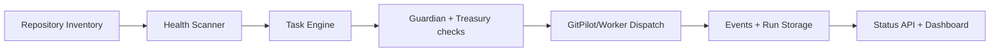

# Matrix Codex 

<div align="left">


</div>

**Matrix Codex** is an autonomous repository-maintenance control plane for the Agent‑Matrix ecosystem.
It scans repo health, plans maintenance work, applies governance and budget checks, dispatches worker runs, and publishes status artifacts.

---

## ✨ What this project does

- 🧭 **Discovers repositories** and keeps an inventory.
- 🩺 **Scans health signals** (CI/test/dependency/lint indicators).
- 🧠 **Builds maintenance tasks** from issues with policy-aware defaults.
- 🛡️ **Applies governance checks** (risk, allowed paths, PR-only boundaries).
- 🚀 **Dispatches worker workflows** into target repositories.
- 📊 **Persists and reports outcomes** through APIs + static status site.

---

## 🧩 How it works (simple diagram)



### Runtime loop

1. `scan-health`
2. `plan-maintenance`
3. `run-maintenance`
4. `report-status`

The scheduled orchestrator executes this same sequence daily.

---

## 🏗️ Architecture overview

### Controller plane (this repository)

- `matrix_codex/health_scanner.py` — detection engine
- `matrix_codex/task_engine.py` — issue → task mapping
- `matrix_codex/main.py` — orchestration loop
- `matrix_codex/orchestration/dispatcher.py` — cross-repo workflow dispatch
- `matrix_codex/storage/models.py` — persistent run/task/event storage

### Service & API

- `apps/backend/main.py` — status/event backend
- `matrix_codex/api/routes.py` — maintainer API routes (`/maintainer/*`)

### Worker side

- `.github/workflows/matrix-maintainer-orchestrator.yml` — controller scheduler
- `matrix_codex/worker_templates/matrix-maintainer.yml` — target repo worker template

---

## ⚙️ Installation

### Option A — recommended

```bash
make install
```

### Option B — direct

```bash
uv sync
```

> If your environment blocks external network access, dependency fetch may fail. In that case use the preinstalled environment and run local commands with `PYTHONPATH=.`.

---

## 🔐 Configuration

Main configuration files:

- `config/repositories.yml` → repo catalog + execution profiles
- `config/policies.yml` → safety boundaries and risk thresholds
- `config/tasks.yml` → health issue → maintenance task behavior

Useful environment variables:

- `GITHUB_TOKEN` / `CROSS_REPO_TOKEN`
- `WORKER_WORKFLOW_FILE`
- `MATRIX_CODEX_EXECUTION_MODE`
- `GITPILOT_MODE`, `GITPILOT_PROVIDER`

---

## 🚀 Usage

### Daily automation

```bash
make run-daily
```

### Manual step-by-step

```bash
matrix-codex scan-health
matrix-codex plan-maintenance
matrix-codex run-maintenance
matrix-codex report-status
```

### Local checks

```bash
make test
```

---

## 🧪 Developer commands

```bash
make install
make test
make lint
make build-site
```

---

## 📡 Status and observability

- API health: `GET /health`
- Controller status: `GET /status`
- Maintainer records: `/maintainer/runs`, `/maintainer/tasks`, `/maintainer/events`, `/maintainer/health_scans`
- WebSocket stream: `WS /ws`

---

## 📚 Documentation

- `docs/technical-guide.md` — technical setup and internals
- `docs/architecture.md` — architecture details
- `docs/ai-maintainer-guide.md` — AI handoff + maintenance playbook
- `docs/usage.md` — quick usage guide

---

## 🤝 Contributing

1. Create a branch.
2. Keep changes small and policy-safe.
3. Run tests and include results in PR notes.
4. Never push directly to `main`.

---

## 📄 License

Apache-2.0
