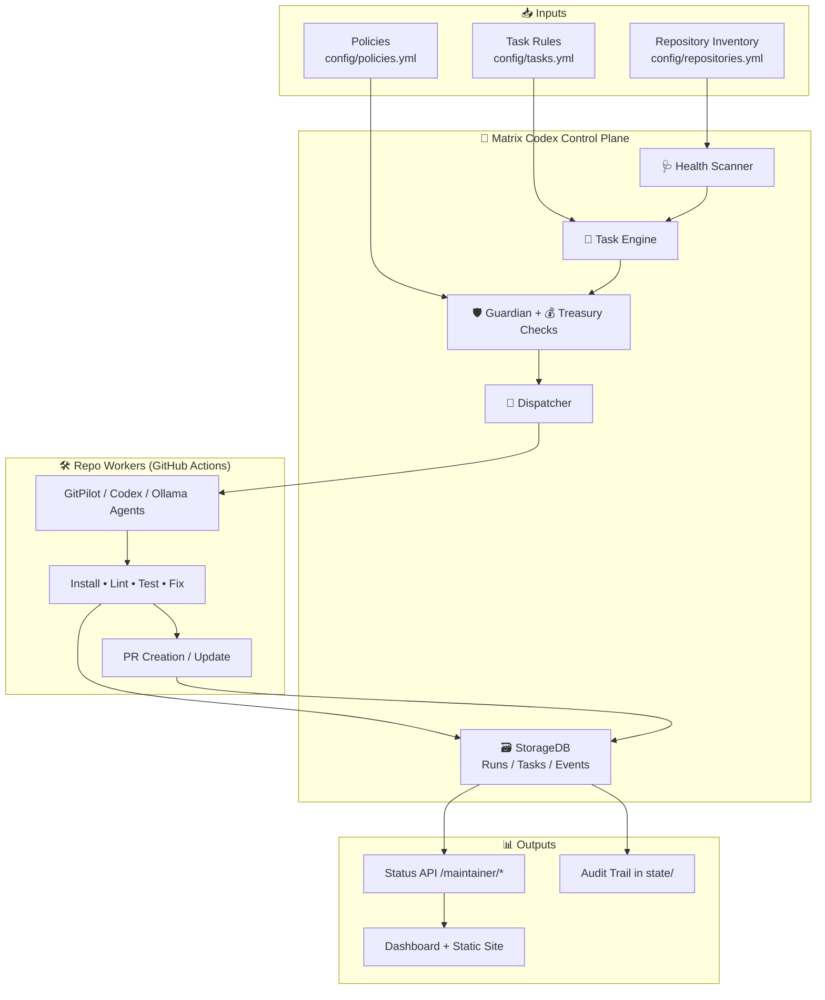

# Matrix Codex 

<p>
  
  
  
  
  
</p>

> **Autonomous maintenance control plane for multi-repository engineering systems.**

Matrix Codex is designed to keep repositories healthy with a governed loop:
**discover → scan → plan → approve → execute → verify → report**.

---

## 🚀 Why Matrix Codex

- ✅ **Scalable maintenance** across many repositories.
- ✅ **Safe by default** with policy + approval + PR-first boundaries.
- ✅ **Agent-ready** architecture for Codex/GitPilot/Ollama-style executors.
- ✅ **Observable** via status APIs, state snapshots, and dashboard artifacts.
- ✅ **Extensible** task engine and profile-based command system.

---

## 🧠 System architecture (improved)



### Loop in one sentence
Matrix Codex scans health issues, converts them into constrained tasks, checks safety/budget, dispatches repo-local workers, and records outcomes for continuous improvement.

---

## 📦 Repository map

### Core controller
- `matrix_codex/main.py` → orchestration loop (`scan`, `plan`, `run`, `report`)
- `matrix_codex/health_scanner.py` → issue detection
- `matrix_codex/task_engine.py` → issue-to-task mapping
- `matrix_codex/orchestration/dispatcher.py` → cross-repo workflow dispatch
- `matrix_codex/storage/models.py` → run/task/event persistence

### API + status
- `apps/backend/main.py` → backend status/event service
- `matrix_codex/api/routes.py` → maintainer API (`/maintainer/runs`, `/tasks`, `/events`, `/health_scans`)

### Worker orchestration
- `.github/workflows/matrix-maintainer-orchestrator.yml` → scheduled controller run
- `matrix_codex/worker_templates/matrix-maintainer.yml` → target repo worker template

---

## ⚙️ Installation

```bash
make install
```

Fallback:

```bash
uv sync
```

If your environment blocks external package download, use pre-installed dependencies and run commands with `PYTHONPATH=.`.

---

## 🔐 Configuration

Edit these files first:

- `config/repositories.yml` → repositories, profiles, commands
- `config/policies.yml` → risk and path restrictions
- `config/tasks.yml` → issue→task behavior per repo

Common environment variables:

- `GITHUB_TOKEN`, `CROSS_REPO_TOKEN`
- `WORKER_WORKFLOW_FILE`
- `GITPILOT_MODE`, `GITPILOT_PROVIDER`
- `MATRIX_CODEX_EXECUTION_MODE`

---

## 🧪 Usage

### End-to-end manual run

```bash
matrix-codex scan-health
matrix-codex plan-maintenance
matrix-codex run-maintenance
matrix-codex report-status
```

### Full daily run

```bash
make run-daily
```

### Tests

```bash
make test
```

---

## 🤖 Compatibility status (verified from repo implementation)

| Platform | Status | Notes |
|---|---|---|
| **Ollama** | 🟡 Partial | `app/agents/ollama_agent.py` exists but currently returns `not_implemented` placeholder. |
| **OllamaBridge** | 🟡 Planned | No dedicated `ollamabridge` adapter currently present in codebase; add bridge client module to enable runtime integration. |
| **Hugging Face Spaces** | 🟢 Supported | Workflow `.github/workflows/sync-matrix-codex-status-to-hf-space.yml` deploys backend/frontend bundle to HF Space. |

For details and rollout checklist, see `docs/compatibility.md`.

---

## 📡 API endpoints

- `GET /health`
- `GET /status`
- `POST /event`
- `WS /ws`
- `GET /maintainer/runs`
- `GET /maintainer/tasks`
- `GET /maintainer/events`
- `GET /maintainer/health_scans`

---

## 📚 Documentation

- `docs/technical-guide.md` — technical setup and internals
- `docs/architecture.md` — architecture notes
- `docs/ai-maintainer-guide.md` — AI handoff and extension guide
- `docs/usage.md` — quick usage walkthrough
- `docs/compatibility.md` — Ollama / OllamaBridge / Hugging Face compatibility matrix

---

## 🧰 Best practices for maintainability

1. Keep tasks small and policy-safe.
2. Prefer PR-only automation.
3. Add tests for every new scanner/task rule.
4. Keep profile commands explicit and reproducible.
5. Record failures clearly in event payloads and PR notes.

---

## 📄 License

Apache-2.0
